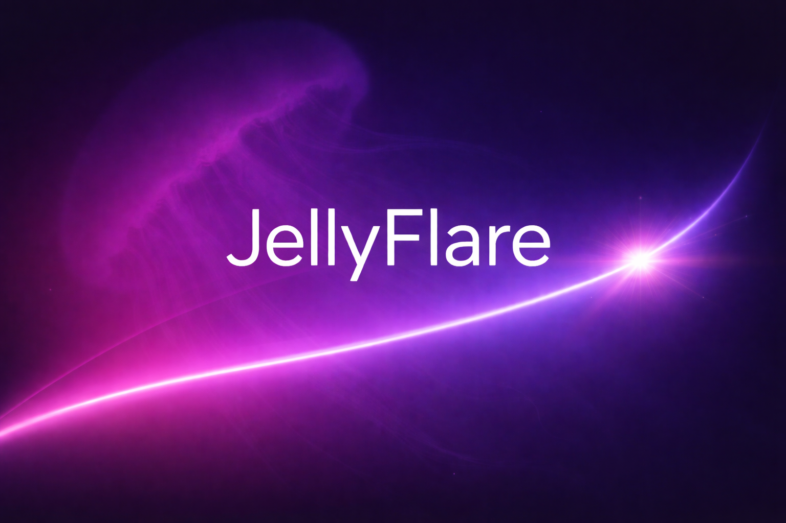
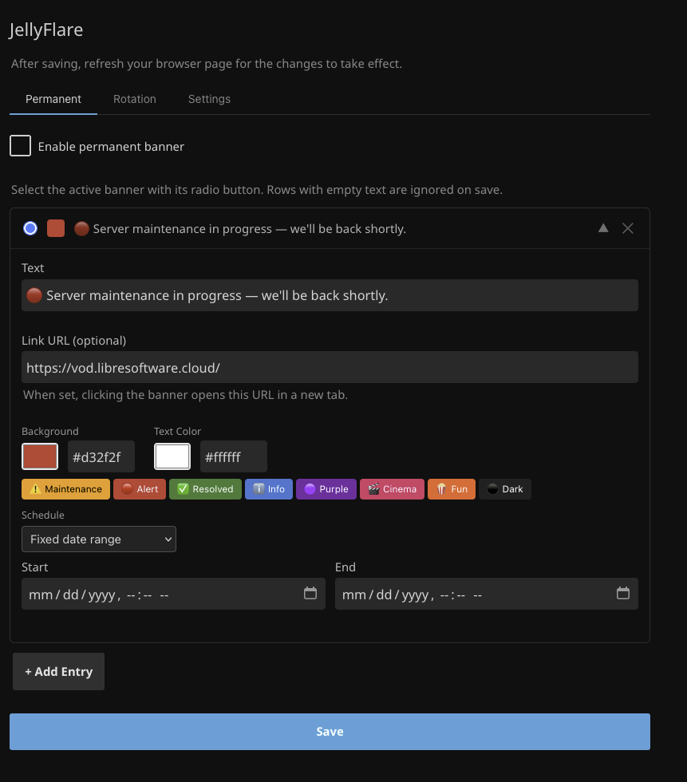
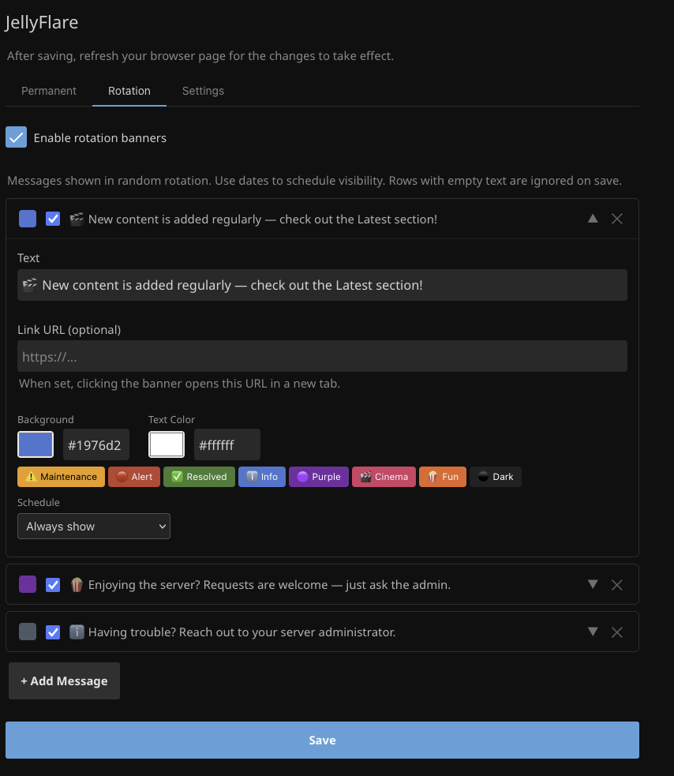
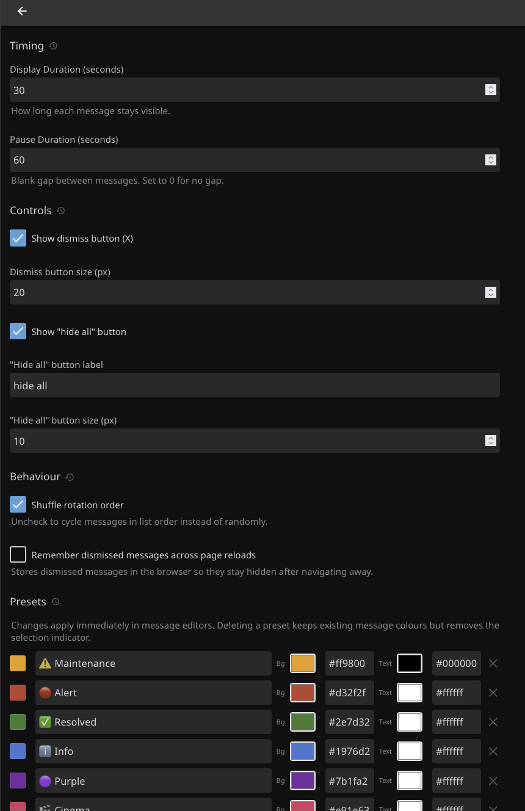

# JellyFlare — Jellyfin Plugin



Put announcements where your users will actually see them — a customisable banner at the top of Jellyfin, with rotating messages, scheduling, and link support.

## Features


- 🔄 Rotating messages with configurable display and pause durations
- 🎨 Per-message background and text colour with a named preset palette
- 📅 Flexible per-message scheduling: always, fixed date range, annual (e.g. Christmas), weekly, or daily time window
- 📌 Permanent banner library — save multiple entries and pick the active one; supersedes all rotation messages when enabled
- 🎛️ Configurable dismiss controls: show/hide × and "hide all" buttons, with custom sizes and label
- 🔗 Optional click-through URL per message — clicking the banner opens a link in a new tab
- 🙈 Option to hide the banner while browsing the admin dashboard

## Prerequisites

Install these three components **in order** before adding JellyFlare:

1. **Jellyfin 10.11.6 or later** — [jellyfin.org](https://jellyfin.org) _(earlier versions are not supported)_

2. **File Transformation** (by IAmParadox27) — required by JS Injector
   Add this repository in **Dashboard → Plugins → Repositories**:

   ```plain
   https://www.iamparadox.dev/jellyfin/plugins/manifest.json
   ```

   Then install **File Transformation** from the Catalog.

3. **JavaScript Injector** (by n00bcodr) — delivers the banner script to the browser
   Add this repository in **Dashboard → Plugins → Repositories**:

   ```plain
   https://raw.githubusercontent.com/n00bcodr/jellyfin-plugins/main/10.11/manifest.json
   ```

   Then install **JavaScript Injector** from the Catalog.

> **Important:** use the **10.11 manifest URLs** listed above for JS Injector (and File Transformation).
> The old 10.10 builds silently fail on Jellyfin 10.11.

## Installation

### Via plugin repository _(recommended)_

1. Go to **Dashboard → Plugins → Repositories** and add:

   ```plain
   https://raw.githubusercontent.com/MorganKryze/jellyflare/main/manifest.json
   ```

2. Go to **Catalog**, find **JellyFlare**, and install it.
3. Restart Jellyfin, then open **Dashboard → Plugins → JellyFlare**.

### Manual

1. Download the ZIP from the [latest release](https://github.com/MorganKryze/jellyflare/releases/latest).
2. Create `<data-dir>/plugins/JellyFlare/` and unzip the archive into it.
3. Restart Jellyfin, then open **Dashboard → Plugins → JellyFlare**.

## Why JellyFlare?

You can already inject arbitrary CSS or JS into Jellyfin using JS Injector alone — so why add another plugin?

Because maintaining a hand-written script gets old fast. JellyFlare gives you:

- **A proper admin UI**: add, edit, and reorder messages from the dashboard; no file editing, no restarts.
- **Scheduling**: show a message only during a fixed date range, every Christmas, specific weekdays, or a daily time window; the script handles it automatically.
- **A permanent-banner library**: save multiple pinned entries and switch the active one in one click.
- **Persistence**: configuration is stored by Jellyfin and survives upgrades; nothing lives in a file you have to back up manually.

If a one-liner banner is all you need, a raw JS Injector script is fine. If you want something you can actually manage, JellyFlare is the upgrade.

## Configuration

The plugin page has three tabs. See [docs/configuration.md](./docs/configuration.md) for field-level details.

### 📌 Permanent tab

Pin a banner that overrides all rotation messages — useful for outage notices or time-sensitive announcements. Manage a library of entries and switch the active one without losing the others.

<details>
<summary>Screenshot</summary>



</details>

### 🔄 Rotation tab

Manage the pool of rotating messages: add, reorder, enable/disable individual entries, and set display timing. Each message has its own colour, optional URL, and schedule.

<details>
<summary>Screenshot</summary>



</details>

### ⚙️ Settings tab

Control visibility (optionally show on admin pages — off by default), appearance (font size, banner height, alignment, transition speed), timing (display and pause durations), dismiss buttons (show/hide, size, label), and the named colour preset palette.

<details>
<summary>Screenshot</summary>



</details>

## Troubleshooting

**Banner not showing?**

- Confirm all three prerequisites are installed and Jellyfin has been restarted after each one.
- Check that you used the **10.11 manifest URLs** listed in Prerequisites — the 10.10 builds silently fail.
- In the Jellyfin admin, verify that **JS Injector** and **File Transformation** both show as _Active_ (not just installed).
- Open your browser's developer console and look for errors from `banner.js`; a 404 means JellyFlare's API is unreachable, likely a missing restart.

## Development

See [docs/development.md](./docs/development.md) for build instructions, the Docker dev loop, and the release workflow.

## Security

To report a vulnerability privately, use **Security → Report a vulnerability** on the GitHub
repository page. See [SECURITY.md](./.github/SECURITY.md) for the full security policy and a
disclosure of all known considerations.

## AI Disclosure

Parts of this project were developed and documented with AI assistance. All code and content were reviewed, tested, and validated by me personally.

## License

GNU General Public License v3 — see [LICENSE](LICENSE). Use, modify, and redistribute freely — but any distributed derivative must also be GPL v3 and open source.
